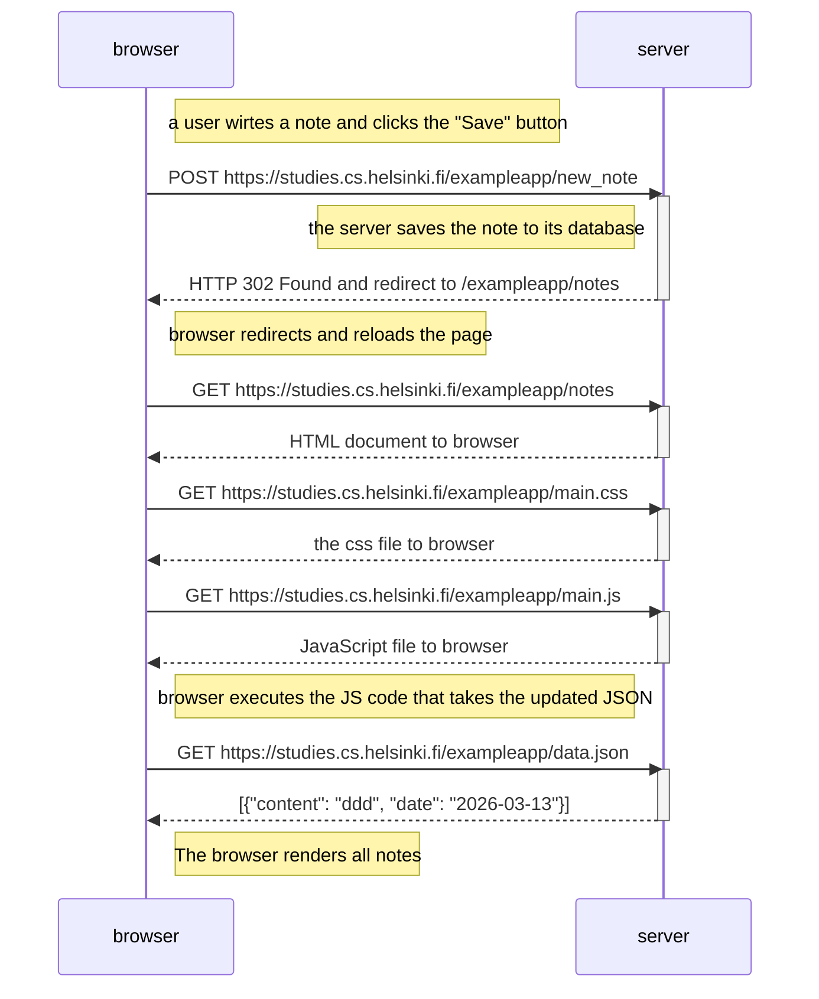

```mermaid
sequenceDiagram
    participant browser
    participant server

    Note right of browser: a user wirtes a note and clicks the "Save" button

    browser->>server: POST https://studies.cs.helsinki.fi/exampleapp/new_note
    activate server
    
    Note left of server: the server saves the note to its database

    server-->>browser: HTTP 302 Found and redirect to /exampleapp/notes
    deactivate server

    Note right of browser: browser redirects and reloads the page

    browser->>server: GET https://studies.cs.helsinki.fi/exampleapp/notes
    activate server
    server-->>browser: HTML document to browser
    deactivate server

    browser->>server: GET https://studies.cs.helsinki.fi/exampleapp/main.css
    activate server
    server-->>browser: the css file to browser
    deactivate server

    browser->>server: GET https://studies.cs.helsinki.fi/exampleapp/main.js
    activate server
    server-->>browser: JavaScript file to browser
    deactivate server

    Note right of browser: browser executes the JS code that takes the updated JSON

    browser->>server: GET https://studies.cs.helsinki.fi/exampleapp/data.json
    activate server
    server-->>browser: [{"content": "ddd", "date": "2026-03-13"}]
    deactivate server
    
    Note right of browser: The browser renders all notes
```