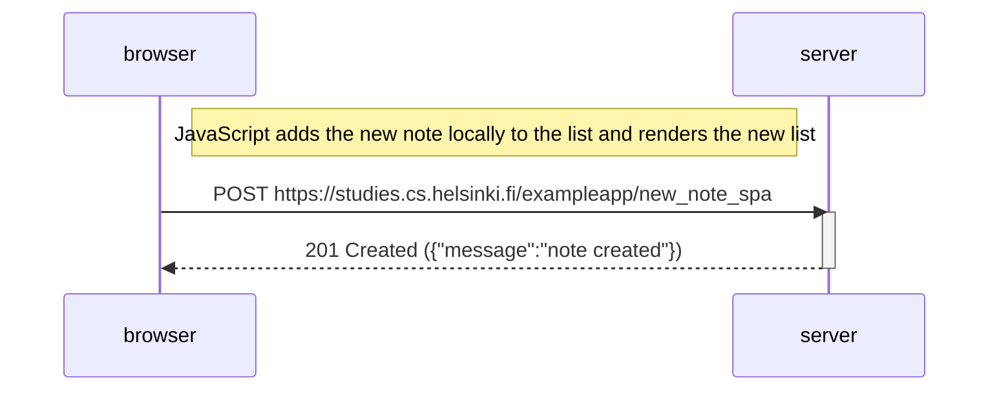

```mermaid

sequenceDiagram
    participant browser
    participant server

    Note right of browser: JavaScript adds the new note locally to the list and renders the new list

    browser->>server: POST https://studies.cs.helsinki.fi/exampleapp/new_note_spa
    activate server
    server-->>browser: 201 Created ({"message":"note created"})
    deactivate server

```